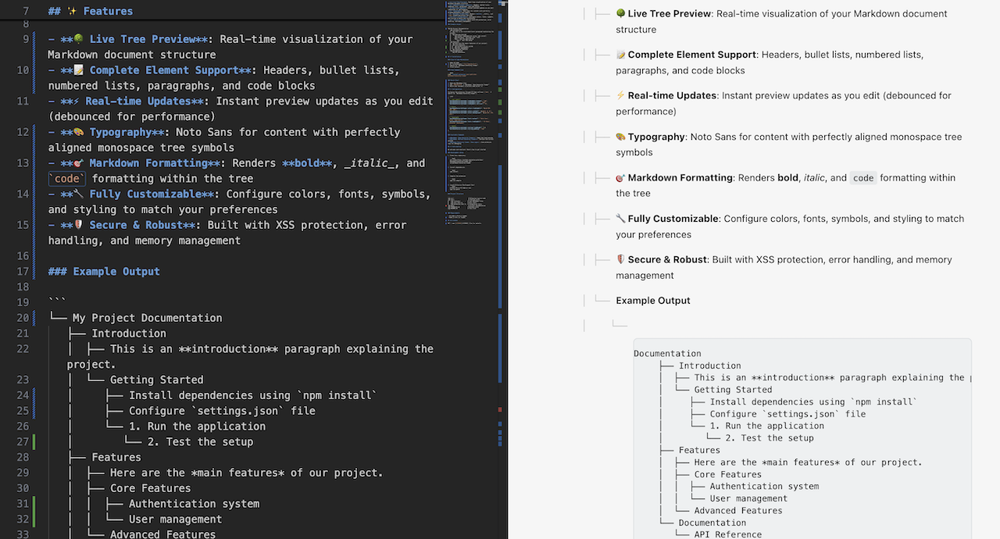

# Markdown Hierarchy Viewer

[](https://marketplace.visualstudio.com/items?itemName=Tony-g-K.markdown-hierarchy-viewer)
[](https://github.com/anton-g-kulikov/markdown-hierarchy-viewer)
[](https://opensource.org/licenses/MIT)

A VS Code extension that transforms your Markdown documents into beautiful, live hierarchical structures.


_Live tree visualization showing the structure of a Markdown document with real-time preview_

## ✨ Features

- **🌳 Live Tree Preview**: Real-time visualization of your Markdown document structure
- **📝 Complete Element Support**: Headers, bullet lists, numbered lists, paragraphs, and code blocks
- **⚡ Real-time Updates**: Instant preview updates as you edit (debounced for performance)
- **🎨 Typography**: Noto Sans for content with perfectly aligned monospace tree symbols
- **🎯 Markdown Formatting**: Renders **bold**, _italic_, and `code` formatting within the tree
- **🔗 Link Rendering**: Clickable links for `[text](url)` and `[text][ref]` style markdown links with hover effects
- **🎨 Customizable Header Styling**: Configure individual font weights for each header level (H1-H6)
- **🔧 Fully Customizable**: Configure colors, fonts, symbols, and styling to match your preferences
- **🛡️ Secure & Robust**: Built with XSS protection, error handling, and memory management

### Example Output

```
└── My Project Documentation
   ├── Introduction
   │  ├── This is an **introduction** paragraph explaining the project.
   │  └── Getting Started
   │     ├── Install dependencies using `npm install`
   │     ├── Configure `settings.json` file
   │     └── 1. Run the application
   │        └── 2. Test the setup
   ├── Features
   │  ├── Here are the *main features* of our project.
   │  ├── Visit [GitHub](https://github.com) for source code
   │  ├── Core Features
   │  │  ├── Authentication system
   │  │  └── User management
   │  └── Advanced Features
   └── Documentation
      └── API Reference
```

## 📦 Installation

### From VS Code Marketplace

1. Open VS Code
2. Go to Extensions (`Ctrl/Cmd+Shift+X`)
3. Search for "Markdown Hierarchy Viewer"
4. Click Install

### From Command Line

```bash
code --install-extension Tony-g-K.markdown-hierarchy-viewer
```

### Quick Start

1. Open any Markdown file
2. Use `Cmd+Shift+P` → "Markdown: Show Hierarchy Viewer"
3. Watch your document structure come alive! 🎉

## ⚙️ Configuration

Customize the extension through VS Code settings (`Cmd+,` → search for "Markdown Hierarchy Viewer"):

```json
{
  // Tree symbols
  "markdownHierarchyViewer.treeSymbols.branch": "├──",
  "markdownHierarchyViewer.treeSymbols.last": "└──",
  "markdownHierarchyViewer.treeSymbols.vertical": "│",

  // Colors
  "markdownHierarchyViewer.colors.treeSymbols": "rgb(200, 200, 200)",
  "markdownHierarchyViewer.colors.content": "rgb(0, 0, 0)",
  "markdownHierarchyViewer.colors.background": "rgb(246, 246, 246)",

  // Typography
  "markdownHierarchyViewer.fonts.content": "'Noto Sans', Arial, sans-serif",
  "markdownHierarchyViewer.fonts.treeSymbols": "'SF Mono', Consolas, monospace",

  // Layout
  "markdownHierarchyViewer.styling.lineHeight": 1.6,
  "markdownHierarchyViewer.styling.padding": "4em",

  // Header Font Weights (customize visual hierarchy)
  "markdownHierarchyViewer.headerStyling.h1FontWeight": "600", // Bold
  "markdownHierarchyViewer.headerStyling.h2FontWeight": "600", // Bold
  "markdownHierarchyViewer.headerStyling.h3FontWeight": "400", // Normal
  "markdownHierarchyViewer.headerStyling.h4FontWeight": "400", // Normal
  "markdownHierarchyViewer.headerStyling.h5FontWeight": "400", // Normal
  "markdownHierarchyViewer.headerStyling.h6FontWeight": "400" // Normal
}
```

### 🎨 Header Styling Customization

By default, the extension uses **bold font weight** for main headers (H1, H2) and **normal font weight** for sub-headers (H3-H6) to create a clear visual hierarchy. You can customize the font weight for each header level individually:

**Common font weight values:**

- `"100"` - Thin
- `"200"` - Extra Light
- `"300"` - Light
- `"400"` - Normal (default for H3-H6)
- `"500"` - Medium
- `"600"` - Semi Bold (default for H1-H2)
- `"700"` - Bold
- `"800"` - Extra Bold
- `"900"` - Black

**Example: Make all headers progressively lighter**

```json
{
  "markdownHierarchyViewer.headerStyling.h1FontWeight": "700",
  "markdownHierarchyViewer.headerStyling.h2FontWeight": "600",
  "markdownHierarchyViewer.headerStyling.h3FontWeight": "500",
  "markdownHierarchyViewer.headerStyling.h4FontWeight": "400",
  "markdownHierarchyViewer.headerStyling.h5FontWeight": "300",
  "markdownHierarchyViewer.headerStyling.h6FontWeight": "200"
}
```

### Available Commands

- **Markdown: Show Hierarchy Viewer** - Open the tree preview
- **Markdown: Refresh Hierarchy Viewer** - Refresh the current preview
- **Markdown: Force Markdown Language Mode** - Manually set file to Markdown mode if not automatically detected
- **Markdown Hierarchy Viewer: Show Logs** - View extension logs for debugging

## 📁 File Support

The extension automatically detects Markdown files with the following extensions:

- `.md` (primary)
- `.markdown`
- `.mdown`
- `.mkd`
- `.mdwn`
- `.mdtxt`
- `.mdtext`
- `.text`

### Troubleshooting File Recognition

If your Markdown file isn't being recognized:

1. **Check the file extension** - Use a supported Markdown extension
2. **Use Force Markdown Mode** - Run "Markdown: Force Markdown Language Mode" from Command Palette
3. **Content-based detection** - For files without extensions, the extension analyzes content for Markdown patterns
4. **VS Code file associations** - Add custom file associations in VS Code settings:
   ```json
   "files.associations": {
     "*.custom": "markdown"
   }
   ```

## 🤝 Contributing

We welcome contributions! Here's how to get started:

### Development Setup

1. Clone this repository

   ```bash
   git clone https://github.com/anton-g-kulikov/markdown-hierarchy-viewer.git
   cd markdown-hierarchy-viewer
   ```

2. Install dependencies

   ```bash
   npm install
   ```

3. Compile the extension

   ```bash
   npm run compile
   ```

4. Launch Extension Development Host
   ```bash
   # Press F5 in VS Code or run:
   npm run watch
   ```

### Project Structure

```
├── src/                    # Extension source code
├── test/                   # Testing suite
│   ├── fixtures/          # Test Markdown files
│   ├── unit.test.ts       # Unit tests
│   └── extension.test.ts  # Integration tests
├── meta/                   # Project documentation
├── CHANGELOG.md           # Release notes
└── README.md              # This file
```

### Requirements

- VS Code 1.101.0 or higher
- Node.js 20.x or higher

## 📄 License

MIT - see the [MIT License](https://opensource.org/licenses/MIT) for details.
